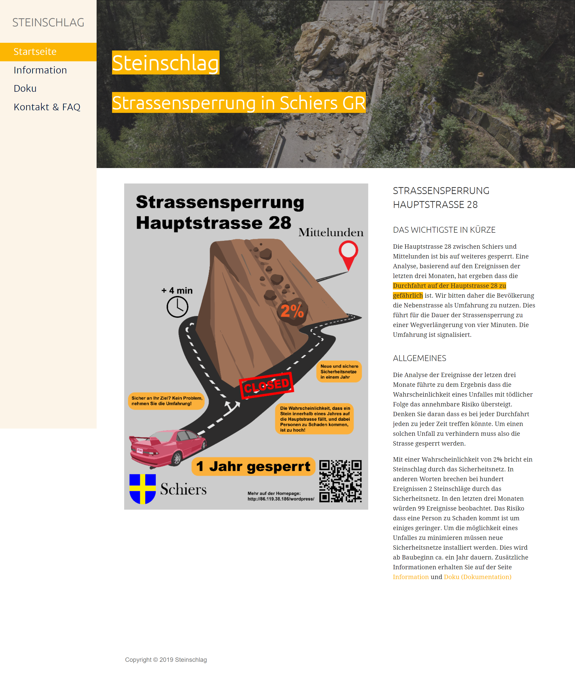
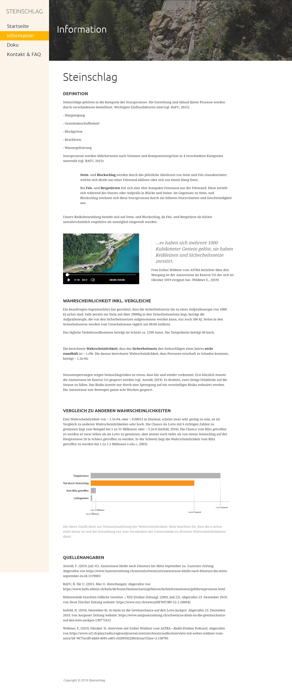
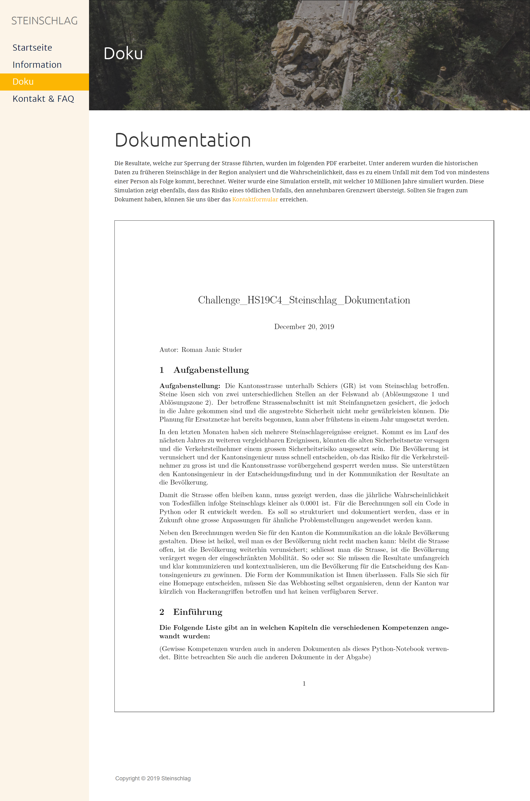
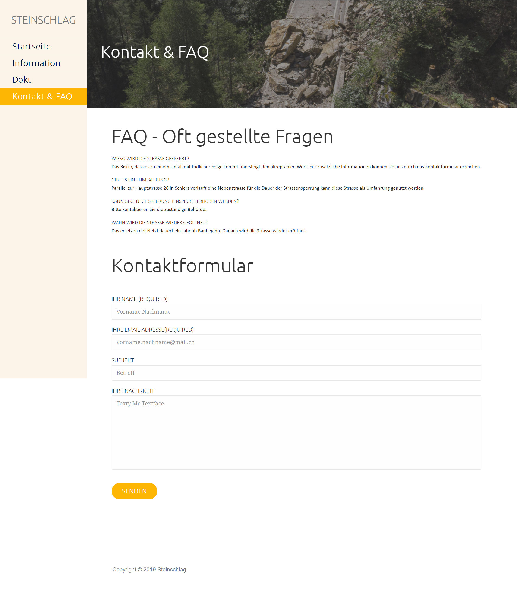

# Rockfall Challenge

## Hypothetical project to calculate the probability of a fatal accident caused by a rock fall

#### Overview
This project was developed by me and my team during the first semester (2019) of our Data Science Bachelor program and includes an R-notebook where the **probability calculations** and a **Monte-Carlo simulation** can be found. The same calculations and simulations were also documented in a Jupyter notebook (in Python). This notebook is written in German.

#### About the Project
The aim of the project was to investigate the probability of a fatal accident caused by a rock fall. For this purpose we received a data set with almost 3 months of data on events on a Swiss mountain road. If the probability of a serious accident with fatal consequences exceeds a previously defined limit, the road must be closed. In our case the simulated and calculated probability exceeded the limit value. The results were communicated to the public in the form of a website. 

#### Getting started

Download the complete [Folder of the Notebook](https://github.com/roman-studer/fhnw-ds-hs2019-rockfall/tree/master/Notebooks) of your choice (written in [R](https://github.com/roman-studer/fhnw-ds-hs2019-rockfall/tree/master/Notebooks/Studer_Roman_HS19C4_RStudio) or [Python](https://github.com/roman-studer/fhnw-ds-hs2019-rockfall/tree/master/Notebooks/Studer_Roman_HS19C4_Python)) and run the Notebook in the folder.
RStudio or Jupyter is required. If you haven't installed either of the both, follow theses instructions: [Jupyter](https://jupyter.readthedocs.io/en/latest/install.html), [R-Studio](https://rstudio.com/products/rstudio/download/)

Both Notebooks are also available as a PDF or HTML which doesn't require the installation of Jupyter or R-Studio.

Or clone the repo and then start the notebooks with the mentioned programs

```
$ git clone https://github.com/roman-studer/fhnw-ds-hs2019-rockfall.git
```

#### Screenshots
The Website on which our results were 'published' is no longer available.
Please consider taking a look at the screenshots of our website.

**Homepage**


**Information**


**Documentation**


**Contact and FAQ**


#### Authors

- Studer Roman (roman.studer1@students.fhnw.ch)
- Gehrig Lukas (gehrig.lukas@students.fhnw.ch)
- Nef Riccard  (riccard.nef@students.fhnw.ch)  